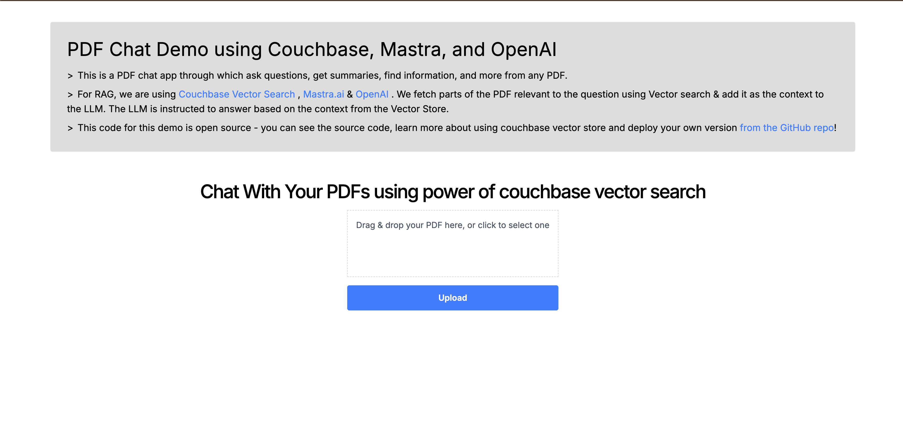
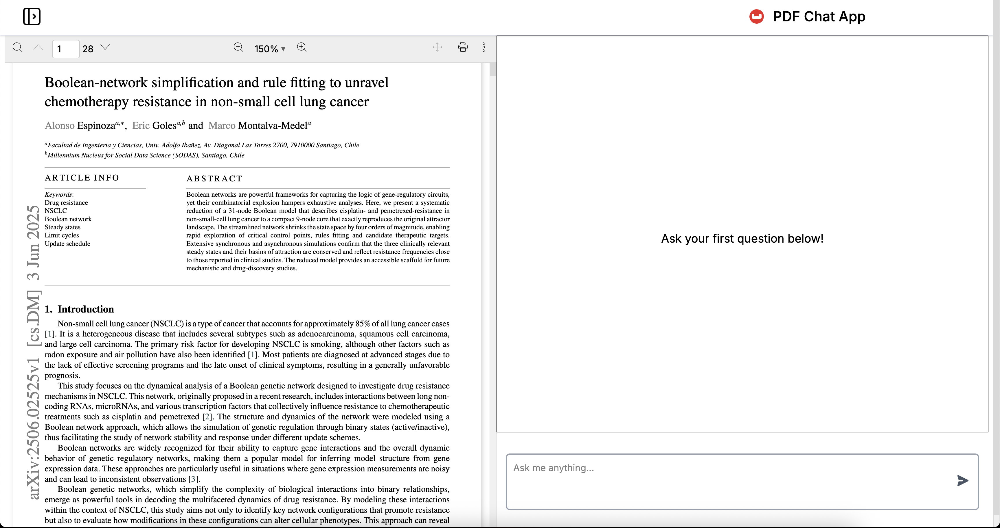

# Couchbase Mastra RAG

A Next.js application that enables users to upload PDF documents and chat with their content using Couchbase vector search and OpenAI embeddings, built with the Mastra framework.

## Quick Start

### Prerequisites

- **Node.js** 22+ and npm/yarn/pnpm
- **Couchbase Capella** account or local Couchbase cluster
- **OpenAI API** key for embeddings and chat

### Installation

1. **Clone and install dependencies**
```bash
git clone https://github.com/couchbase-examples/mastra-nextJS-quickstart.git
cd couchbase-mastra-rag
npm install
```

2. **Environment Configuration**

Create a `.env` file with these required variables:

```bash
# Couchbase Vector Store Configuration
COUCHBASE_CONNECTION_STRING=couchbase://localhost
COUCHBASE_USERNAME=Administrator
COUCHBASE_PASSWORD=your_password
COUCHBASE_BUCKET_NAME=your_bucket
COUCHBASE_SCOPE_NAME=your_scope
COUCHBASE_COLLECTION_NAME=your_collection

# Embedding Configuration
EMBEDDING_MODEL=text-embedding-3-small
EMBEDDING_DIMENSION=1536
EMBEDDING_BATCH_SIZE=100

# Chunking Configuration
CHUNK_SIZE=1000
CHUNK_OVERLAP=200

# Vector Index Configuration
VECTOR_INDEX_NAME=document-embeddings
VECTOR_INDEX_METRIC=cosine

# OpenAI Configuration
OPENAI_API_KEY=your_openai_api_key 
```

### Setup Guide

1. **Couchbase Setup**
   - Create a Couchbase Capella account or local cluster
   - Create a bucket and collection for document storage
   - Get connection credentials and add to environment variables

2. **OpenAI Setup**
   - Get API key from [OpenAI Platform](https://platform.openai.com/api-keys)
   - Add to environment variables

### Running the Application

```bash
# Development Environment
npm run dev

# Production Environment
npm run build
npm start
```

Open [http://localhost:3000](http://localhost:3000) to access the application.

## Screenshots

### PDF Upload Interface



### Chat Interface  



## Usage

1. **Upload PDF**: Drag and drop or select a PDF file (max 100MB)
2. **Processing**: The app will extract text, create embeddings, and store in Couchbase
3. **Chat**: Navigate to the chat interface to ask questions about your document
4. **Search**: The system uses vector similarity search to find relevant content

## Configuration Details

The application automatically validates all required environment variables on startup. Key configurations:

- **Embedding Model**: Uses OpenAI's `text-embedding-3-small` by default
- **Chunking**: Documents split into 100-character chunks with 50-character overlap
- **Vector Search**: Cosine similarity for semantic search
- **File Storage**: PDFs stored in `public/assets/` directory

## Architecture

### System Overview
The application follows a modern RAG (Retrieval-Augmented Generation) pattern with clear separation between frontend, backend, and data layers.

### Frontend Layer
- **Framework**: Next.js 15 with React 19
- **Components**: 
  - `PDFUploader`: Drag-and-drop interface using react-dropzone
  - `InfoCard`: Application information and instructions
  - `chatPage`: Chat interface for document interaction
- **Styling**: Tailwind CSS for responsive design
- **File Handling**: Client-side PDF validation and FormData submission

### Backend Layer
- **API Routes**: 
  - `/api/ingestPdf`: Handles PDF upload, text extraction, chunking, and vector storage
  - `/api/chat`: Chat endpoint for conversational AI functionality
- **Document Processing**: 
  - PDF text extraction using `pdf-parse`
  - Text chunking with configurable size and overlap
  - Embedding generation via OpenAI's text-embedding-3-small

### Data Layer
- **Vector Database**: Couchbase for high-performance vector search
  - Stores document embeddings with metadata
  - Supports cosine similarity search
  - Auto-creates vector indexes for semantic search
- **File Storage**: Local filesystem (`public/assets/`) for uploaded PDFs

### AI & ML Components
- **Embedding Model**: OpenAI text-embedding-3-small (1536 dimensions)
- **Agent Framework**: Mastra for AI agent orchestration
- **Vector Search**: Semantic similarity matching for relevant content retrieval

### Data Flow
1. **Upload**: User uploads PDF → stored locally + FormData sent to API
2. **Processing**: PDF text extracted → chunked → embeddings generated → stored in Couchbase
3. **Query**: User chat input → embedded → vector search → relevant chunks retrieved → LLM response
4. **Response**: Generated answer returned to user interface

### Configuration Management
- Environment-based configuration with validation
- Automatic index creation and management
- Error handling with graceful fallbacks
